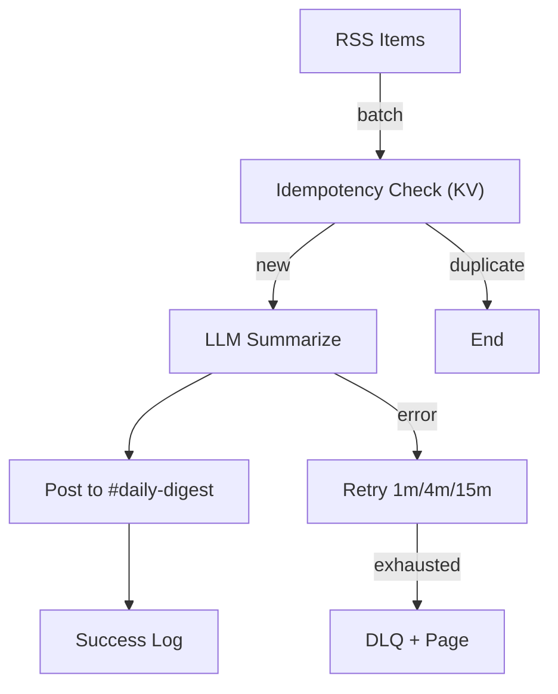
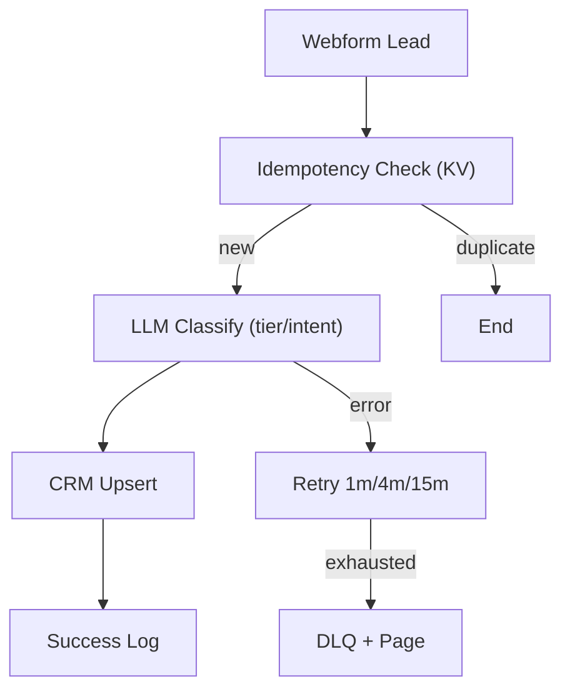
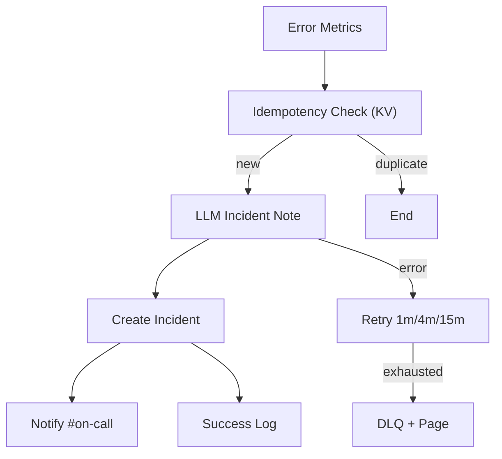

# ✅ Day 16 — Automation Recipes (Sample Output for Students)

> This sample shows exactly what your `Day16_agentic_workflows.md` could look like when “run.”
> - **No external links** (prevents 404s).  
> - **Asset paths shown as inline code** (e.g., `assets/flow_daily_digest.png`).  
> - **Placeholders** are used instead of real secrets or org-specific URLs.

---

## Section 1) Flow Specs (A, B, C)

### Flow A — Daily Digest Summaries
**Purpose** — Aggregate items daily and send a concise summary to a team channel.

**Inputs (sample payload)**
```json
{
  "flow": "A",
  "runDate": "2025-09-01",
  "sourceId": "rss:team-feed",
  "items": [
    {"id": "art-001", "title": "placeholder", "url": "placeholder", "summary": "placeholder"},
    {"id": "art-002", "title": "placeholder", "url": "placeholder", "summary": "placeholder"}
  ]
}
````

**Transformations (concrete LLM prompt)**

```
System: You are a concise editor.
User: Summarize these items into a 5-bullet digest, one key insight each. 
Tone: executive, neutral. Avoid hype. Output: plain text only.
```

**Outputs** — Post message to channel `#daily-digest` with 5 bullets (plain text).

**Reliability & Control**

* **Auth method** — OAuth2 (channel posting app).
* **Idempotency Key Rule** — `flow:A:rss:team-feed:2025-09-01`

  * Dedupe window = 24h; store keys in KV/Redis under `idem_keys`.
* **Retry Policy** — Exponential + jitter: 1m → 4m → 15m.
* **On-fail Route** — Write payload to DLQ `dlq_flow_A` + page on-call.

**Messaging**

* **Success Template** — `Daily Digest posted for {runDate} to #daily-digest.`
* **Fail Template** — `Digest failed for {runDate}. See DLQ ref={dlq_id}. Paging on-call.`

**Security**

* **PII Redaction Rule** — Redact `email`, `phone`, `ssn` with `***` before logging.
* **Secrets Handling** — Use managed vault; never echo tokens.
* **Logging Do** — flowId, status, latencyMs, retryCount, itemCount.
* **Logging Don’t** — URLs with tokens, full payloads, any PII.

**Observability**

* **Metrics** — p95 latency, successRate, retryCount, dlqSize.
* **Alert Thresholds** — successRate < 95%; dlqSize > 10; p95 > 3000ms.
* **Runbook Notes** — Reprocess from `dlq_flow_A` in batches of 10; acknowledge page after creating incident note “Requeued A”.

---

### Flow B — Lead Enrichment & Routing

**Purpose** — Enrich inbound leads with classification and route to CRM queue.

**Inputs (sample payload)**

```json
{
  "flow": "B",
  "sourceId": "webform:contact-us",
  "lead": {
    "name": "placeholder",
    "email": "placeholder@example.com",
    "company": "placeholder",
    "message": "placeholder"
  }
}
```

**Transformations (concrete LLM prompt)**

```
System: You label B2B leads.
User: Classify this lead by tier (A/B/C) and intent (low/med/high).
Return JSON: {"tier":"","intent":"","reason":""}. Keep to 25 words.
```

**Outputs** — Create/Update CRM Lead with fields: `tier`, `intent`, `reason`, `routerQueue`.

**Reliability & Control**

* **Auth method** — OAuth2 (CRM app).
* **Idempotency Key Rule** — `flow:B:webform:contact-us:{email}:{yyyy-mm-dd}`; window=24h; KV/Redis.
* **Retry Policy** — Exponential + jitter: 1m → 4m → 15m.
* **On-fail Route** — DLQ `dlq_flow_B` + page on-call.

**Messaging**

* **Success Template** — `Lead {email} enriched (tier={tier}, intent={intent}).`
* **Fail Template** — `Lead enrichment failed for {email}. DLQ ref={dlq_id}.`

**Security**

* **PII Redaction Rule** — Mask `email` to `e***@***.com` in logs.
* **Secrets Handling** — Managed vault; rotate quarterly.
* **Logging Do** — flowId, status, latencyMs, retryCount, crmUpsert=true/false.
* **Logging Don’t** — Full `message` text, tokens, headers.

**Observability**

* **Metrics** — enrichmentLatency, crmUpsertLatency, successRate, retryCount, dlqSize.
* **Alert Thresholds** — successRate < 97%; dlqSize > 5; enrichmentLatency p95 > 1500ms.
* **Runbook Notes** — To reprocess, dequeue from `dlq_flow_B`, scrub PII, replay to `/flows/B/retry`.

---

### Flow C — Error Spike → Incident Notifier

**Purpose** — Detect error spikes and create an incident with actionable context.

**Inputs (sample payload)**

```json
{
  "flow": "C",
  "sourceId": "service:api-gateway",
  "windowMin": 5,
  "errorCount": 120,
  "baseline": 30,
  "topErrors": [
    {"code": "placeholder", "count": 55},
    {"code": "placeholder", "count": 28}
  ]
}
```

**Transformations (concrete LLM prompt)**

```
System: You write terse incident summaries.
User: Draft a 5-line incident note: scope, probable cause, immediate action, owner, ETA.
Plain text only. No URLs.
```

**Outputs** — Create Incident with note; post summary to channel `#on-call`.

**Reliability & Control**

* **Auth method** — Token (incident API).
* **Idempotency Key Rule** — `flow:C:service:api-gateway:{yyyy-mm-ddThh:mm}`; window=60m; KV/Redis.
* **Retry Policy** — Exponential + jitter: 1m → 4m → 15m.
* **On-fail Route** — DLQ `dlq_flow_C` + immediate page.

**Messaging**

* **Success Template** — `Incident created for spike window {windowMin}m. Notified #on-call.`
* **Fail Template** — `Incident create failed. DLQ ref={dlq_id}. Pager escalated.`

**Security**

* **PII Redaction Rule** — No PII; still scrub stack traces of tokens.
* **Secrets Handling** — Managed vault; scoped tokens with least privilege.
* **Logging Do** — incidentId, status, retryCount, spikeRatio.
* **Logging Don’t** — Raw stack traces, headers.

**Observability**

* **Metrics** — spikeRatio, detectLatency, createLatency, successRate, dlqSize.
* **Alert Thresholds** — detectLatency p95 > 500ms; successRate < 98%; dlqSize > 3.
* **Runbook Notes** — From DLQ, validate spike persists; if false positive, close incident and document reason.

---

## Section 2) Diagrams

> Copy-paste these Mermaid blocks as-is. They are not images, so no 404 risk.

**Flow A — Daily Digest**



Notes on limits/rate limits:

* Ingest: **100 req/min**; bursts up to **20**.
* Back-pressure: queue pending batches; retries with exponential + jitter.

**Flow B — Lead Enrichment**



Notes on limits/rate limits:

* CRM API: **60 req/min** per app; burst **10**.
* Back-pressure: enqueue; respect CRM 429 with retry schedule.

**Flow C — Error Spike to Incident**



Notes on limits/rate limits:

* Incident API: **30 req/min**; burst **5**.
* Back-pressure: hold notifications; prioritize incident creation.

---

## Section 3) Implementation Steps

> Pick one platform per flow. The steps below are specific; adjust names to your tools.
> **Screenshot/export your flow and save to** `assets/flow_daily_digest.png` (inline code, not an image link).

### Flow A — Zapier (Daily Digest)

1. **Trigger:** RSS by Zapier → “New Items in Feed” (batch daily via Schedule).
2. **Storage:** “Storage by Zapier” → Get `idem:{key}`; if exists → stop.
3. **Code Step:** Compute idempotency key `flow:A:{sourceId}:{runDate}`; store in KV.
4. **LLM Step:** Summarize items using the prompt above; output plain text.
5. **Channel Post:** Send summary to `#daily-digest`.
6. **Error Handling:** Paths for error → Delay/Retry (1m/4m/15m) → DLQ record.
7. **Export Screenshot:** Save a screenshot of this Zap to `assets/flow_daily_digest.png`.

**Sandbox/Test Cases (table-driven)**

| Case |             Items | Expect                           |
| ---- | ----------------: | -------------------------------- |
| A1   |                 0 | Post “No items today.”           |
| A2   |                 3 | 3–5 bullets, no duplicates       |
| A3   |                10 | Summarize top 5, truncate safely |
| A4   | duplicate runDate | No post (idempotent)             |

**Expected Output (snippet)**

```
Daily Digest — 2025-09-01
• placeholder
• placeholder
• placeholder
```

---

### Flow B — Make (Integromat) (Lead Enrichment)

1. **Trigger:** Webhooks → Custom webhook receives lead payload.
2. **KV Check:** Data Store → Get `idem:{email}:{yyyy-mm-dd}`; stop if exists.
3. **LLM:** HTTP/AI module → classify tier/intent with JSON response.
4. **CRM Upsert:** Create/Update Lead with fields `tier`, `intent`, `reason`.
5. **Error Route:** Tools → Error handler with 1m/4m/15m retries; else write to DLQ.
6. **Export Screenshot:** Save scenario image to `assets/flow_daily_digest.png`.

**Sandbox/Test Cases**

| Case | Email                       | Message            | Expect               |
| ---- | --------------------------- | ------------------ | -------------------- |
| B1   | [a@ex.com](mailto:a@ex.com) | “placeholder”      | tier set, intent set |
| B2   | [a@ex.com](mailto:a@ex.com) | duplicate same day | deduped, no upsert   |
| B3   | [b@ex.com](mailto:b@ex.com) | long message       | JSON within 25 words |

**Expected Output (JSON)**

```json
{"tier":"placeholder","intent":"placeholder","reason":"placeholder"}
```

---

### Flow C — Power Automate (Incident Notifier)

1. **Trigger:** Recurrence every 5 minutes → query metrics source.
2. **Condition:** If `errorCount / baseline >= 3`, continue; else end.
3. **KV Check:** Compose key `flow:C:service:api-gateway:{yyyy-mm-ddThh:mm}`; dedupe for 60m.
4. **LLM (Connector or HTTP):** Generate 5-line incident note (prompt above).
5. **Create Incident:** Call incident API; capture `incidentId`.
6. **Notify:** Post summary to `#on-call`.
7. **Failures:** Configure 1m/4m/15m retries; then write to DLQ + page.
8. **Export Screenshot:** Save flow image to `assets/flow_daily_digest.png`.

**Sandbox/Test Cases**

| Case | errorCount |        baseline | Expect                           |
| ---- | ---------: | --------------: | -------------------------------- |
| C1   |        120 |              30 | incident created, note generated |
| C2   |         55 |              30 | below threshold, no incident     |
| C3   |        120 | 30 (dup window) | no duplicate incident            |

**Expected Incident Note (plain text)**

```
Scope: placeholder
Cause: placeholder
Action: placeholder
Owner: placeholder
ETA: placeholder
```

---

## Export Guidance (All Flows)

* Take a screenshot of your flow builder and save it as `assets/flow_daily_digest.png`.
* Ensure the file exists **before** you reference it in any markdown.
* Do **not** create clickable image links; show the path as inline code only.

---

## Submission Checklist

* [x] One file named `Day16_agentic_workflows.md` produced.
* [x] Each flow includes idempotency rule, retries (1m/4m/15m), DLQ route, and pager note.
* [x] Each flow contains at least **one concrete LLM prompt**.
* [x] Mermaid diagrams included and copy-pasteable.
* [x] Numeric rate limits and back-pressure are stated.
* [x] PII redaction, secret handling, and logging rules documented.
* [x] Test cases + expected outputs shown.
* [x] Asset path shown as inline code: `assets/flow_daily_digest.png`.

```
```
