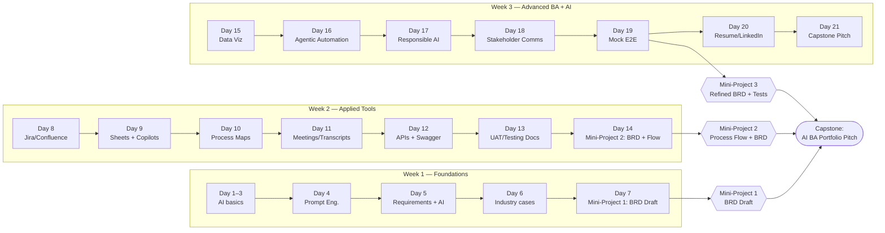
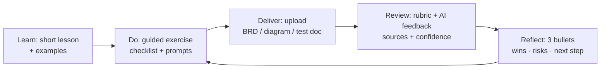
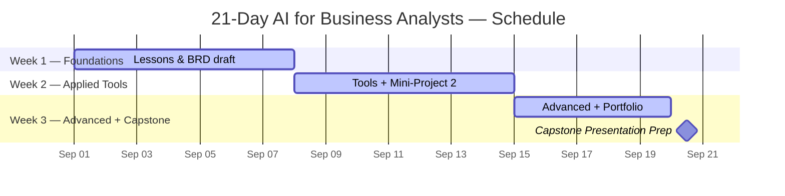

# 🎓 AI for Business Analysts — 21-Day Accelerator


> **Recommended repo name:** `ai-ba-21day-accelerator`  
> **Program summary (≤300 chars):** 21-day accelerator for business analysts to master applied AI. Daily lessons and mini-projects cover RAG, automation, data viz, APIs, testing, and stakeholder comms—ending with a portfolio-ready capstone and AI-assisted BRD.

---

## 📌 Who This Is For
- Mid-level BAs (~$70–85K) seeking an AI edge  
- Pros from construction, homebuilding, automotive, retail, and other slow-adoption industries  
- Anyone targeting a *real BA role* in a tech-forward org

---

## 🗓 Structure
- **3 Weeks (21 Days)**
- **Daily lessons** = short theory + hands-on task
- **3 Mini-Projects + 1 Capstone**
- **Deliverables**: AI-assisted BRD, process flows, testing docs, resume/LinkedIn refresh

---

## 📂 Weekly Breakdown

### Week 1 — Foundations
Learn AI basics, from “what is an LLM?” to writing your first AI-assisted BRD.

- **Day 1:** Intro to AI  
- **Day 2:** Generative vs Agentic AI  
- **Day 3:** Core AI Terms (models, datasets, inference)  
- **Day 4:** Prompt Engineering Basics  
- **Day 5:** Using AI for Requirements Gathering  
- **Day 6:** Case Studies — AI in slow-moving industries  
- **Day 7:** **Mini-Project 1** — Draft a BRD w/ AI assistance  

### Week 2 — Applied Tools
Hands-on AI in BA workflows.

- **Day 8:** AI in Jira & Confluence  
- **Day 9:** Excel/Google Sheets + AI Copilots  
- **Day 10:** Process Mapping with AI (Lucidchart, Mermaid, Visio)  
- **Day 11:** AI for Meeting Notes/Transcripts  
- **Day 12:** API Docs + Swagger/Postman with AI  
- **Day 13:** AI for UAT & Testing Docs  
- **Day 14:** **Mini-Project 2** — BRD + Process Flow refinement  

### Week 3 — Advanced BA + AI
Build career-defining skills & produce portfolio artifacts.

- **Day 15:** AI for Data Visualization (PowerBI, Tableau, RShiny)  
- **Day 16:** Agentic AI & Workflow Automation (Zapier, Make, Power Automate)  
- **Day 17:** Responsible AI (bias, governance, hallucinations)  
- **Day 18:** AI for Stakeholder Communication  
- **Day 19:** Mock End-to-End Project  
- **Day 20:** Resume & LinkedIn Upgrade w/ AI  
- **Day 21:** **Capstone** — “How I Use AI as a BA in Tech” (portfolio pitch)  

---

## 🎯 Projects
- **Mini-Project 1:** AI-generated BRD draft  
- **Mini-Project 2:** Process Flow (AI-generated diagrams) + refined BRD  
- **Mini-Project 3:** Refined BRD with testing plan  
- **Capstone:** AI BA Portfolio Pitch (slides + talking points)

---

## 🛠 Tools Covered
**LLMs:** ChatGPT, Claude, Gemini • **BA Tools:** Jira, Confluence, Trello • **Office:** Excel, Google Sheets • **Process Maps:** Lucidchart, Mermaid, Visio • **Data Viz:** PowerBI, Tableau, RShiny • **APIs:** Swagger, Postman, GitHub Copilot • **Automation:** Zapier, Make, Power Automate

---

## ⚡ Quickstart

```bash
# 1) Clone the repo
git clone https://github.com/<you>/ai-ba-21day-accelerator.git
cd ai-ba-21day-accelerator

# 2) Open README and pick your starting week/day
# 3) Use the /Projects folders as your submission targets
````

**Submission format:** Each day’s task lives in its `Week*/Day*` file; project deliverables go in `/Projects/...`. Include sources, screenshots, and any AI prompts used.

---

## 📁 Folder Tree

```text
ai-ba-21day-accelerator/
│
├── README.md
├── Week1_Foundations/
│   ├── Day01_intro_to_ai.md
│   ├── Day02_genAI_vs_agenticAI.md
│   ├── Day03_core_terms.md
│   ├── Day04_prompt_engineering.md
│   ├── Day05_ai_for_requirements.md
│   ├── Day06_ai_for_industries.md
│   └── Day07_project_brd.md
│
├── Week2_Applied_Tools/
│   ├── Day08_jira_confluence.md
│   ├── Day09_excel_google_sheets.md
│   ├── Day10_ai_process_maps.md
│   ├── Day11_meeting_notes.md
│   ├── Day12_api_docs_ai.md
│   ├── Day13_ai_for_testing.md
│   └── Day14_project_brd_refinement.md
│
├── Week3_Advanced/
│   ├── Day15_ai_data_viz.md
│   ├── Day16_agentic_workflows.md
│   ├── Day17_responsible_ai.md
│   ├── Day18_ai_stakeholder.md
│   ├── Day19_mock_project.md
│   ├── Day20_resume_linkedin_ai.md
│   └── Day21_capstone_presentation.md
│
└── Projects/
    ├── MiniProject1_BRD_Draft/
    ├── MiniProject2_ProcessFlow/
    ├── MiniProject3_Refined_BRD/
    └── Capstone_AI_BA_Pitch/
```

---

## 🧭 Program Maps (Mermaid)

> GitHub renders Mermaid automatically. If a diagram fails to render, ensure you copied the full fenced code block (including \`\`\`mermaid).

### 1) 3-Week Flow → Projects → Capstone



### 2) The Daily Loop (What to Expect Each Day) — **fixed**



### 3) Gantt Schedule (adjust dates as needed)



---

## 🧪 Submission Rubric (Projects)

| Criterion                 | What We Look For                                                                  | Weight |
| ------------------------- | --------------------------------------------------------------------------------- | :----: |
| **Clarity & Structure**   | Clear scope, assumptions, acceptance criteria; concise, business-friendly writing |   25%  |
| **Evidence & Citations**  | Sources listed; AI outputs reference files/metrics; correctness                   |   25%  |
| **Reproducibility**       | Steps/tools noted; prompts or configs included; diagrams exportable               |   25%  |
| **Impact & Storytelling** | Insightful conclusions; stakeholder-ready visuals; actionable recommendations     |   25%  |

> **Pass bar:** ≥ 80% overall and no category below 60%.

---

## 🔐 License & Notes

* License: **DACR** (Defensive AI Commercial Rights)
* Keep sensitive data out of the repo. Use synthetic/public examples where needed.

---

## ✅ Outcome

By Day 21 you will:

* Confidently apply AI in BA workflows
* Produce AI-assisted deliverables that *ship*
* Present a polished **AI BA portfolio pitch** ready for hiring managers

```
