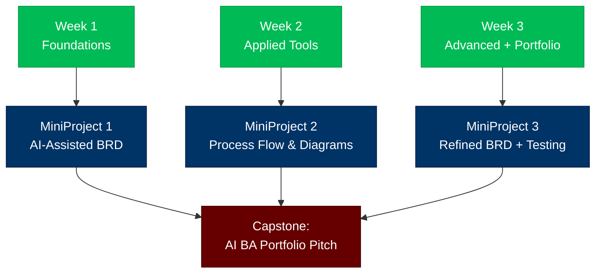
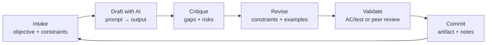

# Week 1 — Foundations (Days 1–7)

## 🎯 Week Outcomes

* Speak BA + AI fluently (LLMs, agents, prompts, hallucinations).
* Run a basic AI-assisted requirements process end-to-end.
* Ship **MiniProject1: AI-Assisted BRD Draft** with review notes.

## 📅 Day-by-Day Plan

### Day 1 — What AI Can/Can’t Do (for BAs)

**Focus:** LLM basics, capabilities, limits, safe use.
**Hands-on (45–60m):** Prompt an LLM to summarize a simple feature request and extract actors, data, dependencies.
**Deliverable:** `Day01_intro_to_ai.md` (key terms + one paragraph on limits).
**QA Check:** You can explain *prompt → output → validation* in 90 seconds.

---

### Day 2 — Generative vs. Agentic AI

**Focus:** When to use chat vs. tools/automations.
**Hands-on:** Design a simple agent sketch (inputs, tools, guardrails) for a BA intake flow.
**Deliverable:** `Day02_genAI_vs_agenticAI.md` (diagram + 5 bullets).
**QA Check:** You can defend your guardrails.

---

### Day 3 — Core Terms That Actually Matter

**Focus:** Models, tokens, embeddings, vector search, latency/cost.
**Hands-on:** Compare two prompts and measure token counts & cost (use a cost estimator or mock calc).
**Deliverable:** `Day03_core_terms.md` (term table + cost math).
**QA Check:** You can estimate prompt cost within ±20%.

---

### Day 4 — Prompt Engineering for BAs

**Focus:** Task framing, constraints, evaluation prompts.
**Hands-on:** Write 3 prompts: (1) extraction, (2) rewrite for stakeholders, (3) critique for gaps.
**Deliverable:** `Day04_prompt_engineering.md` (prompt → output → critique).
**QA Check:** Outputs improve after revision (show before/after).

---

### Day 5 — AI for Requirements Gathering

**Focus:** From stakeholder notes → user stories → acceptance criteria.
**Hands-on:** Feed a short meeting note; generate **user stories**, **AC**, **open questions**; then red-team it.
**Deliverable:** `Day05_ai_for_requirements.md`.
**QA Check:** AC are testable; open questions reduce ambiguity.

---

### Day 6 — Case Studies (Low-AI Sectors)

**Focus:** Construction, homebuilding, automotive, retail—patterns of value.
**Hands-on:** Pick 1 sector; map 3 AI use cases (impact, risk, data needs).
**Deliverable:** `Day06_ai_for_industries.md` (use-case table).
**QA Check:** Each use case ties to a measurable KPI.

---

### Day 7 — MiniProject1: AI-Assisted BRD Draft

**Focus:** Package your work into a reviewable BRD draft.
**Hands-on:** Use Day 1–6 outputs to assemble a **BRD skeleton** (problem, scope, actors, stories, AC, risks).
**Deliverable:** `Projects/MiniProject1_BRD_Draft/BRD_v1.md`.
**QA Check (rubric):** Clear scope, testable AC, known unknowns, stakeholder-ready tone.

---

## 🧪 Week 1 Acceptance Criteria (Pass/Ready)

* [ ] You can explain “LLM vs Agent” with one diagram and one example.
* [ ] Your Day 5 AC are testable, and open questions are specific.
* [ ] Your BRD v1 includes **scope, actors, 6–12 stories, AC, risks/assumptions**.
* [ ] You demonstrate a prompt improvement loop (draft → critique → revision).

---

## 📦 MiniProject1 — AI-Assisted BRD (Submission)

**Folder:** `Projects/MiniProject1_BRD_Draft/`
**Files:**

* `BRD_v1.md` (core document)
* `prompts_used.md` (top 3 prompts + why they worked)
* `risk_register.md` (at least 5 risks, mitigations, owners)
* `review_notes.md` (self-critique + next changes)

**Grading snapshot (0–100):**

* Structure & clarity (25)
* Testable AC (25)
* Risk realism (20)
* Prompt discipline (15)
* Stakeholder tone (15)

---

## 3-Week Flow → Projects → Capstone

---

## 2) The Daily Loop (What to Expect Each Day) — fixed

---

## 🧰 Starter Prompts (copy/paste)

* **Extraction (Day 5):**
  *“You are a senior BA. From the notes below, extract actors, systems, dependencies. Draft 6–10 user stories with testable acceptance criteria. List 10 ‘known unknowns’ as questions for stakeholders. Keep it concise, bullet-first.”*

* **Critique:**
  *“Red-team the draft BRD: find ambiguity, risky assumptions, missing NFRs (security, performance, data). Score each issue (impact/probability) and suggest fixes.”*

* **Rewrite for Stakeholders:**
  *“Rewrite the summary for a non-technical VP in 150 words, emphasizing outcomes, risks, and next decision.”*

---

## 🔁 How Week 1 Feeds Weeks 2–3

* **Week 2:** Turn your BRD into **diagrams**, **meeting summaries**, **API notes**, and **UAT** docs.
* **Week 3:** Build a **portfolio narrative**, tie metrics to outcomes, present a **capstone** with artifacts.

---
