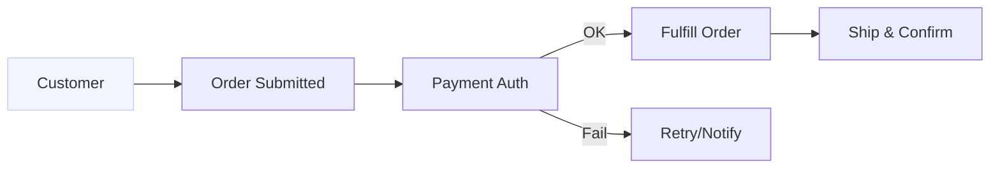

# Week 2 — Applied Tools (Days 8–14)

## 🎯 Week Outcomes

* Operationalize your BRD in **Jira + Confluence** with tight traceability.
* Stand up **Sheets/Excel** for KPI tracking and backlog ops.
* Produce **board-ready process maps** (Mermaid/Lucidchart/Visio).
* Turn meetings into **decisions, owners, and dates**—not just notes.
* Convert user stories → **API specs** (OpenAPI) → Postman tests.
* Ship **UAT docs** from acceptance criteria with coverage you can defend.
* Deliver **MiniProject2: BRD + Process Flow Refinement** (linked artifacts).

---

## 📅 Day-by-Day Plan

### Day 8 — AI in Jira & Confluence

**Focus:** Backlog hygiene, traceability, doc hygiene.

**Hands-on (60–90m)**

1. **Backlog from BRD**

   * Export stories/AC from Week 1 → CSV for Jira bulk create (or API).
   * Use AI to **normalize titles**, **expand AC**, and **label components**.
2. **Confluence page kit**

   * Create BRD parent page with children: *Scope*, *Stories*, *Decisions*, *Risks*.
   * Auto-summaries for execs (≤150 words).

**Deliverables**

* `Day08_jira_confluence.md` (JQL, page links, screenshots)
* `tools/templates/jira_bulk_template.csv` (columns: *Summary, Description, Issue Type, Labels, Story Points, Epic Link*)

**Starter JQL**

```text
project = {{PROJECT_KEY}} AND type in (Story, Task) 
AND "Epic Link" = {{EPIC_KEY}} ORDER BY Rank ASC
```

**Confluence Skeleton**

```md
# {{PROJECT_NAME}} — BRD (Executive Summary ≤150 words)

## Scope
- In / Out
## Stories (linked to Jira)
- {{JIRA_FILTER_URL}}
## Decisions (DDL)
- YYYY-MM-DD | Decision | Owner | Rationale | Status
## Risks
- Risk | Impact | Likelihood | Mitigation | Owner
```

**AI Prompts**

* *“You are a BA lead. Normalize these 12 story titles (max 10 words), expand AC in Given/When/Then, add labels {frontend, backend, data, risk}. Return CSV columns: Summary, Description, AC (bulleted), Labels.”*

---

### Day 9 — Excel/Google Sheets + AI Copilots

**Focus:** Backlog ops + KPI sheet you’ll reuse in Week 3.

**Hands-on**

* Build **Backlog Ops** tab (status, points, owner, due, risk flag).
* Create **KPI Scorecard** tab (lead/lag metrics) with traffic-light rules.
* Use Copilot/Formula suggestions to **estimate t-shirt sizes** and **flag slippage**.

**Deliverables**

* `Day09_excel_google_sheets.md` (screens + formulas)
* `tools/templates/kpi_backlog_sheet.xlsx` (or link)

**Helpful formulas**

```excel
=IF([@[Due]]<TODAY(),"Overdue","On Track")
=IFERROR(XLOOKUP([@[Story ID]],Stories[ID],Stories[Points]),"")
=LET(p,[@[Points]],IF(p<=3,"S",IF(p<=5,"M",IF(p<=8,"L","XL"))))
```

**AI Prompt**

* *“You are a PMO analyst. From this backlog table, compute: weekly throughput, aging >14d, and forecast date to clear backlog at current throughput. Return formulas I can paste into Google Sheets.”*

---

### Day 10 — Process Mapping with AI (Lucidchart, Mermaid, Visio)

**Focus:** From text → diagram; keep it **board-clean**.

**Hands-on**

* Draft **current state** from BRD & notes.
* Generate **Mermaid** for README and **Lucid/Visio** for exec slides.
* Add **swimlanes** and **handoff risks**.

**Deliverables**

* `Day10_ai_process_maps.md` (Mermaid + export links)
* `assets/process_current.png`, `assets/process_target.png`

**Mermaid (example)**



**AI Prompt**

* *“Generate Mermaid for the process below with swimlane labels as node prefixes (Cust:, Ops:, Fin:). Minimize nodes (<12), highlight bottlenecks with comments.”*

---

### Day 11 — AI for Meeting Notes/Transcripts

**Focus:** Notes → **decisions, owners, dates**.

**Hands-on**

* Feed transcript/notes to AI → **Decision & Action Register (DAR)**.
* Extract **RACI** for top 3 decisions.
* Draft **one-page exec brief** (≤120 words).

**Deliverables**

* `Day11_meeting_notes.md` (DAR table + brief)
* `tools/templates/decision_log.md`

**DAR Table**

```md
| Date | Decision | Owner | Due | Rationale | Dependencies | Status |
|------|----------|-------|-----|-----------|--------------|--------|
| YYYY-MM-DD | Adopt auth library X | Eng Lead | YYYY-MM-DD | OWASP compliance | Vendor review | Open |
```

**AI Prompt**

* *“Summarize the transcript into: (1) 5 bullet executive brief, (2) Decisions table with Owner & Due, (3) Risk list with mitigation. Reject unsupported claims.”*

---

### Day 12 — API Docs + Swagger/Postman with AI

**Focus:** User stories → **OpenAPI** → Postman tests.

**Hands-on**

* Draft **OpenAPI** (minimal) for 2–3 endpoints implied by BRD.
* Ask AI to **generate example requests/responses** and **Postman tests**.
* Add **error codes** and **rate limit note**.

**Deliverables**

* `Day12_api_docs_ai.md` (OpenAPI snippet + Postman export)
* `tools/openapi.yaml` (minimal, validated)

**OpenAPI Skeleton**

```yaml
openapi: 3.0.3
info: { title: "{{PROJECT_NAME}} API", version: "0.1.0" }
paths:
  /orders:
    post:
      summary: Create order
      requestBody:
        required: true
        content: { application/json: { schema: { $ref: "#/components/schemas/OrderIn" } } }
      responses:
        "201": { description: Created, content: { application/json: { schema: { $ref: "#/components/schemas/OrderOut" }}}}
        "400": { description: Bad Request }
components:
  schemas:
    OrderIn: { type: object, required: [customerId, items], properties: { customerId: {type: string}, items: {type: array, items: {type: string}} } }
    OrderOut: { type: object, properties: { id: {type: string}, status: {type: string} } }
```

**AI Prompt**

* *“From these user stories + AC, draft OpenAPI 3.0 (paths/schemas) for create/list/order-status. Include request/response examples and Postman tests in JSON.”*

---

### Day 13 — AI for UAT & Testing Docs

**Focus:** AC → **test cases** → coverage.

**Hands-on**

* Convert AC to **test cases** (positive/negative, edge).
* Build a **traceability matrix** (Story ↔ AC ↔ Test).
* Draft **Test Plan** (scope, env, risks, entry/exit criteria).

**Deliverables**

* `Day13_ai_for_testing.md`
* `tools/templates/uat_test_cases.xlsx`
* `tools/templates/traceability_matrix.xlsx`

**Traceability (snippet)**

```md
| Story | AC ID | Test ID | Type | Priority | Status |
|-------|------:|---------|------|----------|--------|
| US-12 | AC-12.1 | TC-045 | Positive | High | Not Run |
```

**AI Prompt**

* *“Generate UAT test cases from these AC using boundary values and error conditions. Return table fields: Test ID, Preconditions, Steps, Expected, Priority, Data.”*

---

### Day 14 — Mini-Project 2 — BRD + Process Flow Refinement

**Goal:** Upgrade your Week 1 BRD with **tool-level reality**.

**Required Artifacts**

* **Updated BRD** with **Jira links** and **Decision Log**.
* **Process maps** (current + target) with bottlenecks highlighted.
* **OpenAPI draft** (2–3 endpoints) + **Postman tests**.
* **UAT pack** (test plan + test cases + traceability).
* **KPI sheet** (lead/lag indicators + traffic lights).

**Folder**

```
Projects/MiniProject2_ProcessFlow/
├── BRD_v2.md
├── decision_log.md
├── process_current.png
├── process_target.png
├── openapi.yaml
├── postman_collection.json
├── uat_test_plan.md
├── uat_test_cases.xlsx
├── traceability_matrix.xlsx
└── kpi_backlog_sheet.xlsx
```

**Rubric (0–100)**

* Traceability (Stories ↔ AC ↔ Tests ↔ API) — 25
* Diagram clarity & handoffs/bottlenecks — 20
* API realism (errors, examples, tests) — 20
* UAT depth & coverage — 20
* KPI/ops readiness — 15

**Pass bar:** ≥ 80 total and **no** category < 60.

---

## ✅ Week 2 Acceptance Criteria

* [ ] Jira backlog aligned with BRD (clean JQL shows full scope).
* [ ] Confluence BRD has **Executive Summary**, **Decision Log**, **Risks**.
* [ ] Process maps show **handoffs & bottlenecks**.
* [ ] OpenAPI + Postman exist and match top user stories.
* [ ] UAT artifacts cover **happy + edge + negative** paths.
* [ ] KPI sheet renders traffic lights and highlights slippage.

---

## 🔧 Reusable Prompts (Copy/Paste)

**Backlog normalize (Day 8):**
*“You are a BA lead. Normalize story titles (≤10 words), expand AC in Given/When/Then, tag labels {frontend, backend, data, risk}. Output CSV: Summary, Description, AC, Labels, Story Points (S/M/L/XL).”*

**KPI craft (Day 9):**
*“Design a KPI scorecard for a SaaS onboarding flow: 3 leading, 3 lagging metrics, clear calc formulas, and traffic-light thresholds. Keep to a single sheet.”*

**Process map (Day 10):**
*“Create a Mermaid flowchart (<12 nodes) from this text, show actor swimlane prefixes, annotate 3 bottlenecks as comments, and propose 2 fixes.”*

**Decision log from notes (Day 11):**
*“From this transcript, extract a Decision & Action Register (table) with Owners and Due dates. Flag unresolved items and conflicting statements.”*

**API spec (Day 12):**
*“From these stories, generate OpenAPI 3 (create/list/get status). Include auth header, error codes (400/401/429/500), and 2 Postman tests per endpoint.”*

**UAT expansion (Day 13):**
*“Transform AC into UAT tests using boundary analysis and negative scenarios. Return: ID, Preconditions, Steps, Expected, Priority, Data, Coverage tag.”*

---

Want me to auto-generate the day files (`Day08_…md` → `Day14_…md`) and the template CSV/XLSX stubs next?
