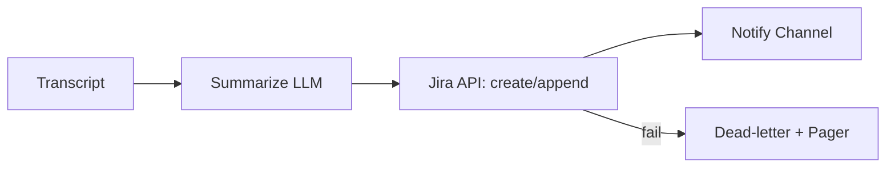

# Week 3 — Advanced BA + AI (Days 15–21)

## 🎯 Week Outcomes

* Ship **executive-grade visuals** (PowerBI/Tableau/R/Shiny) with a clear narrative.
* Orchestrate **agentic workflows** (Zapier/Make/Power Automate) with retries & alerts.
* Implement **Responsible AI** guardrails (policy, DPIA-lite, evals, red-team tests).
* Communicate like an exec: **one-pagers, board briefs, and stakeholder plans**.
* Run a **mock end-to-end project** with traceability from BRD → UAT → Dashboard.
* Upgrade **resume & LinkedIn** with quantified impact stories.
* Deliver a **Capstone**: “How I Use AI as a BA in Tech” + portfolio demo.

---

## 📅 Day-by-Day Plan

### Day 15 — AI for Data Visualization (PowerBI / Tableau / R Shiny)

**Focus:** Insight > pretty charts. Build a leadership dashboard that answers “so what?”

**Hands-on (60–90m)**

1. **Data prep:** Create a tidy table (date, cohort, feature, metric, value).
2. **Visuals:**

   * KPI tiles (ARR/throughput/churn),
   * Trend w/ YoY/DoD deltas,
   * Funnel or Pareto,
   * Variance waterfall (plan vs actual).
3. **Narrative layer:** Annotation cards (why it moved; next action; owner + date).

**Deliverables**

* `Day15_ai_data_viz.md` (screenshots + “insight text” under each viz)
* `assets/dashboard_kpis.png`, `assets/dashboard_variance.png`
* Optional: `pbix/` or `twbx/` or `rshiny/`

**Design checklist**

* Max 5 visuals per page; left-to-right decision flow.
* Traffic-light rules & deltas; show targets and p50/p95 when relevant.
* Every chart has “**Takeaway**” (≤20 words) + “**Action**” (verb + owner + date).

**AI Prompt (viz notes → narrative)**

> “You are a data storytelling coach. From these KPIs and trends, write 3 bullets: (1) insight, (2) cause hypothesis, (3) action with owner/date. Keep each bullet ≤18 words.”

---

### Day 16 — Agentic AI & Workflow Automation (Zapier / Make / Power Automate)

**Focus:** Hands-free glue. Summarize, file, notify—and fail safely.

**Hands-on**

* Flow A: **Meeting → Summary → Jira** (transcript → 5-bullet brief → create/append Jira ticket).
* Flow B: **Daily digest** (Slack/Teams → summarize Top 10 decisions → email + Confluence page).
* Flow C: **Backlog hygiene** (stale tickets → auto-ping owner + escalate if >7d).

**Deliverables**

* `Day16_agentic_workflows.md` (diagrams + links/exports)
* `assets/flow_daily_digest.png`
* Error policy snippet (idempotency keys, 3x retry, dead-letter queue)

**Guardrails**

* Idempotency (hash payloads), retries (exponential backoff), alert on DLQ, redact PII before LLM calls.

**Mermaid (sample)**



**AI Prompt (flow spec → steps)**

> “Generate a Zap/Make/Power Automate recipe: inputs, transformations, auth, retry policy, idempotency key, on-fail route, success/fail messages.”

---

### Day 17 — Responsible AI (Bias • Governance • Hallucinations)

**Focus:** Make AI safe, auditable, and useful.

**Hands-on**

* Draft **AI Use Policy** (what/when/how; no PII in prompts; approvals).
* **DPIA-lite** for one workflow (risks, mitigations, residual risk).
* **Eval harness:** 10 prompts + expected behaviors; score hallucination & safety.
* **Red-team:** 8 attacks (prompt injection, data exfil, role jailbreak); capture outcomes.

**Deliverables**

* `Day17_responsible_ai.md` (policy + DPIA-lite + eval table + red-team log)
* `tools/templates/ai_policy.md`, `tools/templates/dpia_lite.md`

**Eval table (snippet)**

```md
| ID | Scenario | Expected | Observed | Pass? | Notes |
|----|----------|----------|----------|-------|-------|
| E-03 | Unknown KPI value | “Unknown” + ask for source | “Unknown; need data file” | ✅ | Good refusal
```

**AI Prompt (policy)**

> “Draft a 1-page AI Use Policy for a BA team: data handling, model use, approvals, logging, incident response. Plain English.”

---

### Day 18 — AI for Stakeholder Communication

**Focus:** Executive voice: brief > essay.

**Hands-on**

* Produce **Executive One-Pager** (Problem, Options, Rec, Risks, Next 30/90).
* Create 3 **audience versions**: CEO, Ops lead, Engineering.
* Generate **slides**: title, 3 big ideas, decision request, appendix.
* Write **FAQ** (10 Q/A to pre-empt pushback).

**Deliverables**

* `Day18_stakeholder_comms.md`
* `assets/one_pager.png`, `slides/pitch_deck.pdf`

**AI Prompt (voice & tone)**

> “Rewrite for CEO (concise, decision-first), Ops (how-to + owners), Eng (risks/feasibility). 120 words max each. Keep the same recommendation.”

---

### Day 19 — Mock End-to-End Project

**Focus:** Tie it all together (2–3 hours, time-boxed).

**Scope**

* BRD → backlog (Jira), API draft (OpenAPI), UAT pack, dashboard KPIs, daily digest flow.
* Decision memo + board brief.

**Deliverables (folder)**

```
Projects/Mock_EndToEnd/
├── BRD.md
├── jira_export.csv
├── openapi.yaml
├── uat_test_plan.md
├── test_cases.xlsx
├── dashboard.png
├── automation_flow.json
├── decision_memo.md
└── board_brief.md
```

**Acceptance (0–100)**

* Traceability (Story↔AC↔Test↔API) — 30
* Dashboard insight/action quality — 20
* Automation reliability (retries/alerts) — 20
* Exec comms clarity — 20
* Governance (logs, policy refs) — 10
  **Pass:** ≥ 85, no item < 60.

---

### Day 20 — Resume & LinkedIn Upgrade w/ AI

**Focus:** Quantify impact; lead with outcomes.

**Hands-on**

* **Resume.md**: 5 bullets per role using **STAR/CAR**, each quantified.
* **LinkedIn About**: 3-paragraph story (Who I help, Proof, What I’m building).
* **Featured**: link BRD, dashboard, decision memo, automation flow.

**Deliverables**

* `Day20_resume_linkedin.md`, `resume.md`, `linkedin_about.md`

**AI Prompts**

* *Bullets:* “Rewrite with strong verb, metric, and business outcome. ≤22 words.”
* *Headline:* “Create 5 LinkedIn headlines mixing credibility + outcome + niche.”
* *Summary:* “Draft a 3-paragraph About that proves BA + AI impact with one case.”

---

### Day 21 — Capstone: “How I Use AI as a BA in Tech”

**Focus:** 7–10 min portfolio pitch + Q\&A.

**Structure (slides)**

1. The Problem (before)
2. The System (after): workflows & guardrails
3. Evidence (dashboard, UAT, OpenAPI, automation)
4. Decisions & Outcomes (what changed)
5. Risks & Governance (how you made it safe)
6. The Ask (role, engagement, next steps)

**Deliverables**

* `Day21_capstone_presentation.md`
* `slides/capstone_deck.pdf`
* `assets/demo_script.md` (live run order + links)

**Capstone Rubric (0–100)**

* Story & structure — 20
* Artifact quality (live or screenshots) — 25
* Executive clarity (decision-first) — 20
* Governance maturity — 15
* Q\&A handling — 20
  **Pass bar:** ≥ 90.

---

## ✅ Week 3 Acceptance Criteria

* [ ] Dashboard communicates **what changed & why** with actions/owners.
* [ ] Automation handles **errors, retries, and alerts**; no secrets in logs.
* [ ] AI policy + DPIA-lite exist; **eval/red-team log** captured.
* [ ] One-pager + slide mini-deck for **exec readership**.
* [ ] Mock project shows **end-to-end traceability**.
* [ ] Resume/LinkedIn emphasize **outcomes**, not tasks.
* [ ] Capstone deck + demo script ready for a 10-min run-through.

---

## 🔧 Reusable Prompts (Copy/Paste)

**Data → Narrative (Day 15)**

> “From these KPI deltas, write 3 crisp bullets: insight, cause hypothesis, action (owner/date). No hedging.”

**Automation spec (Day 16)**

> “Design a Make scenario that summarizes channel messages daily, deduplicates by thread, posts digest at 4pm, retries x3 with exponential backoff, and alerts on failure. Return step list + error policy.”

**Responsible AI (Day 17)**

> “Create a 1-page AI Use Policy for BA workflows (PII, logging, approvals, incident response) plus a DPIA-lite template with 8 risks and mitigations.”

**Exec rewrite (Day 18)**

> “Rewrite this update for a CEO: decision-first opening, 3 bullets (impact, risk, next step), max 110 words.”

**Traceability check (Day 19)**

> “Validate that each user story maps to AC, a test case, and at least one API path. Return gaps and a fix plan.”

**Resume bullets (Day 20)**

> “Convert these tasks into impact bullets with numbers (ARR, cycle time, accuracy). Start with a strong verb; ≤22 words.”

**Capstone polish (Day 21)**

> “Turn this outline into a 9-slide talk track with time stamps, live demo cues, and a 3-question anticipatory FAQ.”

---
